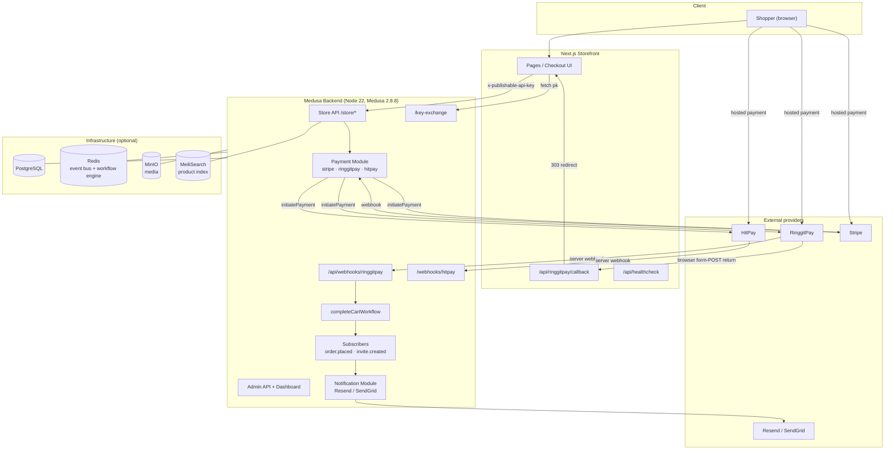
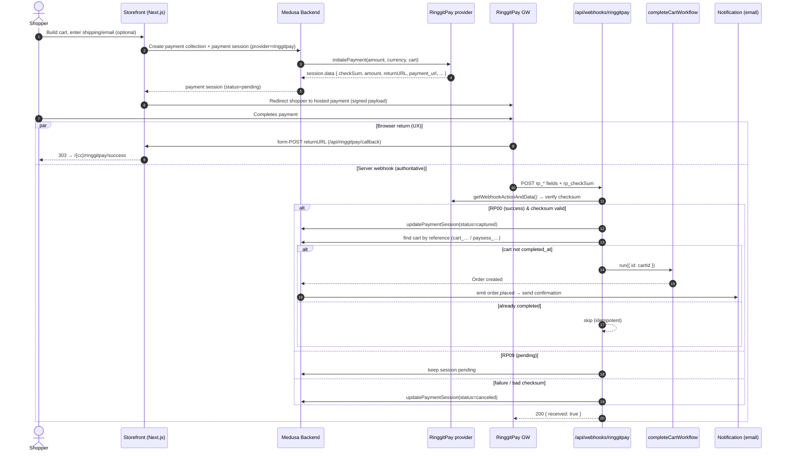
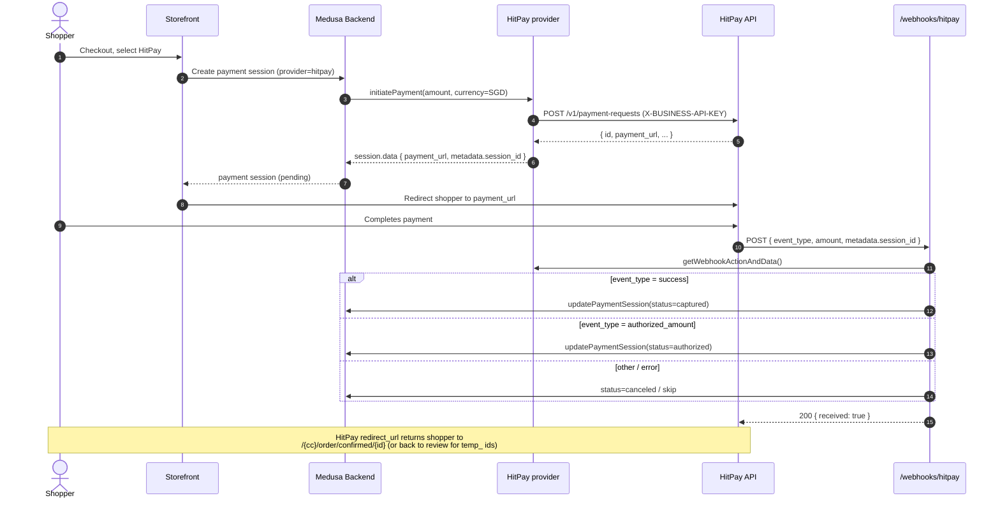
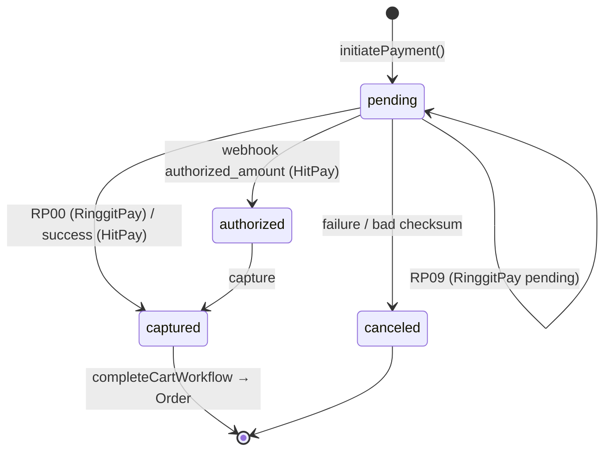
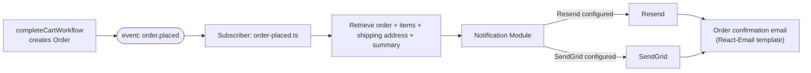
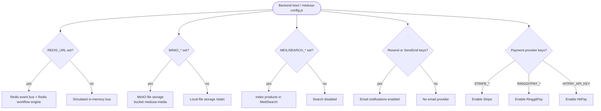

# Workflow & Architecture Diagrams

**Last updated:** 2026-06-24

Diagrams are written in [Mermaid](https://mermaid.js.org/) and render on GitHub,
in VS Code (with a Mermaid extension), and in most Markdown viewers.

---

## 1. System architecture

---

## 2. Checkout → payment → order (happy path, RinggitPay)

---

## 3. Checkout → payment (HitPay)

---

## 4. Payment-session state machine

---

## 5. Order-confirmation notification flow

---

## 6. Graceful-degradation decision flow (backend boot)

